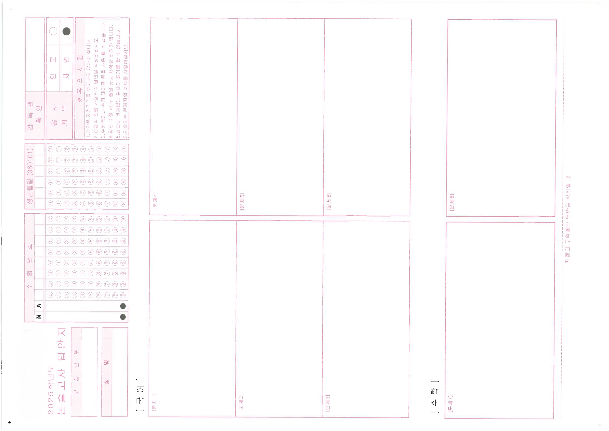
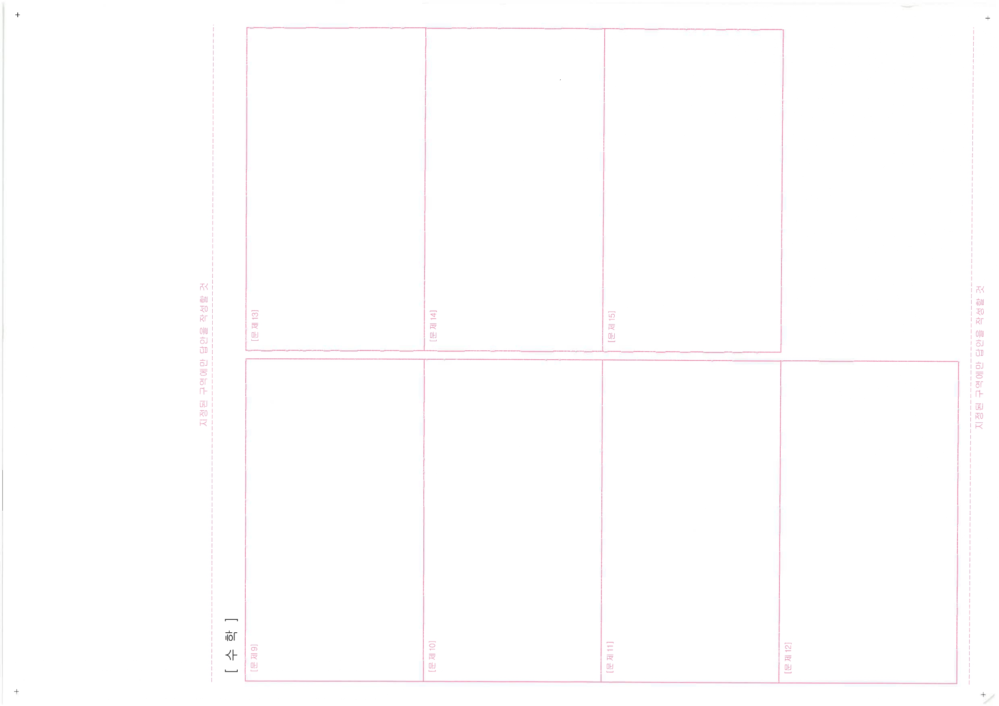
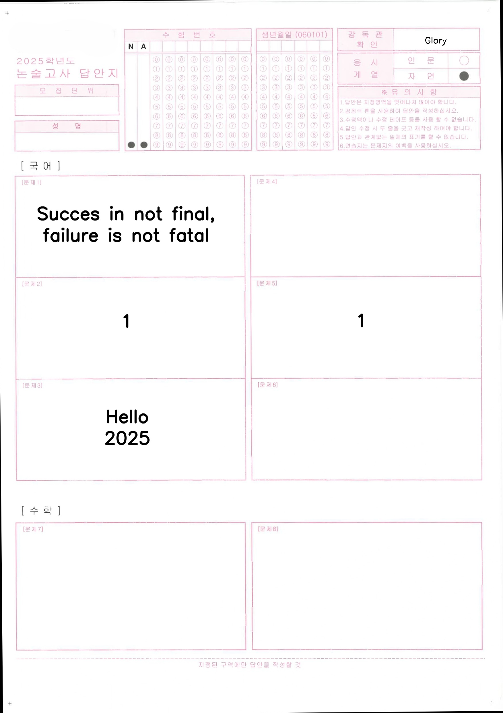
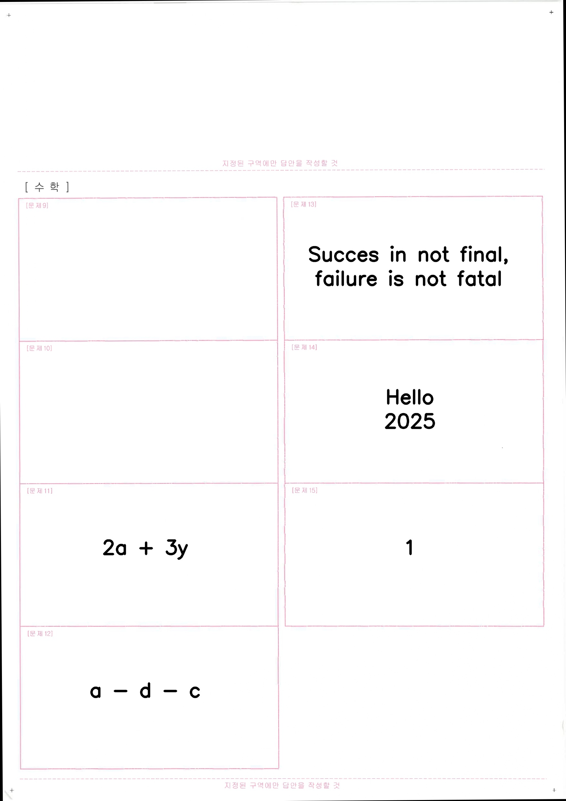
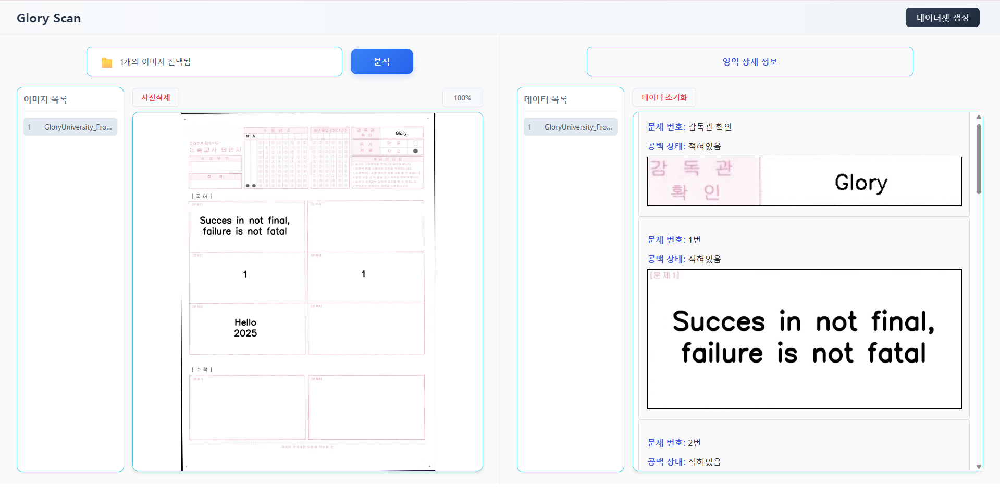

# 논술 공백 탐지 자동화 시스템
> 논술 답안 이미지에서 답안 영역을 자동으로 감지하고, 공백 여부를 판별하거나,
> 비어있는 논술용지 이미지를 기반으로 텍스트가 삽입된 테스트 및 학습용 데이터셋 이미지를 생성하는 React + FastAPI 기반 OCR 프로젝트입니다.

## 📌 프로젝트 배경 및 해결하고자 한 문제

### 🎯 왜 이 프로젝트가 필요한가?

현재 논술 답안지 채점 업무에서는, 스캔된 이미지에서 **양식별로 좌표를 수작업으로 지정**하고, 해당 영역에 필기 상태를 보고 채점하는 방식이 사용되고 있습니다.  
그러나 다음과 같은 한계가 존재합니다:

- 답안지 양식 종류가 다양해 **좌표 지정 작업이 반복적이고 번거로움**
- 스캔 이미지가 약간이라도 회전되면 **기존 좌표가 어긋나 재스캔이 필요**
- 공백인 문제에 대해 빠르게 점수를 부여하고 싶지만 **자동 판단 로직이 없음**

### 🎯 이 프로젝트의 목표는?

> OCR(문자 인식)과 이미지 처리 기술을 활용해  
> 논술 답안지의 **문제 영역, 테두리, 공백 여부를 자동 탐지**하고  
> **동적으로 좌표를 생성하여 반복적인 수작업을 자동화**하는 것입니다.

이를 통해 다음과 같은 효과를 기대할 수 있습니다:
- 양식별 수동 작업 제거 → **좌표 자동 인식**
- 이미지 회전에 강한 구조 → **스캔 실패율 감소**
- 문제별 공백 여부 판별 → **자동 채점 처리 효율화**

## 🚀 주요 기능

### 🧪 1. 문제 영역 공백 분석
- 논술 답안 이미지(.jpg/.png/.pdf 등) 업로드
- 각 문제 영역을 자동으로 분할
- EasyOCR을 이용한 텍스트 유무 판별
- 공백 여부 결과 + 잘린 문제 영역 이미지 반환 (Base64 형식)

### 🧾 2. 텍스트 삽입 데이터셋 생성
- 사용자가 이미지를 업로드하고 생성할 이미지 수(count)를 설정
- 이미지 내 문제란 위치를 분석한 뒤, 랜덤 텍스트를 삽입하여 샘플 이미지 생성
> 현재는 생성된 이미지가 /storage 디렉토리에 저장되며,
> 추후에는 프론트엔드에서 직접 다운로드 받을 수 있도록 개선할 예정입니다.


---

## 🧱 기술 스택

| 영역 | 기술 |
|------|------|
| Frontend | React, Axios, CSS Modules |
| Backend | FastAPI, Python 3.10 |
| OCR | EasyOCR |
| 이미지 처리 | NumPy, OpenCV |
| 데이터 통신 | REST API (`multipart/form-data`) |
| 배포 대상 | 로컬 실행 (개발 기준), 향후 Docker 지원 예정 |

---

## ⚙️ 프로젝트 구조

```
project-root/
├── backend/
│ ├── main.py # FastAPI 실행 진입점
│ ├── app/
│ │ ├── api/endpoints/ # /analyze, /generate API 정의
│ │ ├── services/ # 데이터셋 생성, 공백 분석 서비스 계층
│ │ │ ├── utils/ # 이미지 전처리, 좌표 계산, 텍스트 검출, 공백 확인, 문제 순서 검증 유틸
│ │ ├── utils/ # services 공통 유틸
│ ├── requirements.txt
├── frontend/
│ ├── components/Modal, Button, Upload 등
│ ├── App.js
│ ├── index.js
├── storage/ # 생성 이미지 저장 폴더
└── docs/ # 시연 이미지 or gif 저장 폴더
```

---

## 🧪 테스트 데이터

### 📄 1. 테스트용 논술 답안지 양식
- 실제 업무에서 사용되는 비어있는 논술 답안지 PDF를 기반으로 한 이미지

🖼️ 논술용지 샘플 이미지:
다음 이미지는 비어있는 논술용지 샘플입니다.

#### 앞면 샘플


#### 뒷면 샘플


### 🖼️ 2. 생성된 학습용 데이터셋 샘플
- `/generate` 기능으로 생성된 샘플 이미지
- 회전, 텍스트 랜덤 삽입, 문제 구역 텍스트 마킹이 적용된 학습용 이미지들
- OCR 모델 학습, 증강용 데이터셋으로도 활용 가능

🖼️ 데이터셋 생성 예시:
다음 이미지는 생성된 데이터셋 샘플입니다.

#### 앞면 샘플


#### 뒷면 샘플


---

## 분석 기능 결과
- 업로드된 답안 이미지에서 문제 영역 자동 탐지
- 각 문제 영역의 공백 여부 분석 결과 (예: 공백 / 작성됨)
- 분석된 이미지 예시 (결과 시각화)

🖼️ 분석 결과 창:
다음 이미지는 프로젝트의 분석 결과를 나타낸 창입니다.



## 🛠 실행 방법

### 1. 백엔드 (FastAPI)
```
cd backend
python -m venv venv
source venv/bin/activate  # or venv\Scripts\activate
pip install -r requirements.txt
uvicorn main:app --reload
```

### 1. 프론트엔드 (React)
```
cd frontend
npm install
npm start
```

## 🧭 프로젝트 회고 및 개선 방향

### 1. 처리 속도에 대한 고민

초기에는 인식 정확도를 우선시하여 OCR 엔진으로 EasyOCR을 선택했다.  
Tesseract와의 비교 테스트도 진행했는데, **인쇄체 기준으로는 Tesseract도 꽤 높은 정확도를 보였으며 처리 속도는 더 빨랐다.**  
하지만 실제 논술용지에는 **한글-영문 혼합, 작은 글씨, 복잡한 레이아웃** 등이 많았고,  
이 경우 EasyOCR이 **멀티랭귀지 인식과 레이아웃 처리에서 더 우수한 성능**을 보여 최종적으로 EasyOCR을 채택했다.

다만 EasyOCR은 이미지 1장 처리에도 수 초가 소요되며, 대량 처리나 실시간 응답을 요구하는 환경에서는 병목이 발생했다.  
→ **향후에는 입력 유형에 따라 Tesseract와 EasyOCR을 분기 처리하는 구조를 고려**하고 있다.

### 2. 예외 상황 처리 미흡

기능 구현을 우선적으로 진행하면서, 프론트엔드는 주로 기능 확인과 테스트를 위한 목적으로 구축하였다.
이로 인해 입력 이미지에 문항이 없거나 OCR이 정상적으로 인식되지 않는 경우,
사용자에게 제공되는 피드백이나 오류 메시지가 다소 제한적이었다.

이를 개선하기 위해, **서버 측 오류 로그를 보다 명확하게 출력**하고,
**클라이언트 단에서 직관적인 응답 메시지를 제공하는 구조로 리팩토링할 예정**이다.
사용자가 문제 발생 원인을 쉽게 이해할 수 있도록, **UX 관점의 예외 처리 체계 강화**를 할 생각이다.

### 3. 확장 계획

논술 시험 응시 인원이 많고, 각 응시자의 답안지가 **여러 명의 채점자(선생님)에게 분배되어 채점**되는 구조인 점을 고려할 때,
**단일 사용자 또는 단일 세션 기반의 논술 이미지 처리 방식에는 한계가 있다.**

이를 해결하기 위해, **사용자 계정 기반으로 논술 이미지와 분석 결과를 관리할 수 있는 기능을 추가할 계획**이다.
데이터베이스를 도입하여, 각 선생님이 본인 계정으로 로그인하고
자신에게 할당된 논술용지를 확인·처리할 수 있도록 구조화할 예정이다.

→ 향후에는 **논술지 상태 관리(예: 미분석/완료/검토 중)** 및 **역할 기반 권한 제어(RBAC)** 도 고려하고 있다.

## 👤 개발자 정보

| 항목     | 내용                                    |
|----------|-----------------------------------------|
| 이름     | 서영광                                  |
| 역할     | React 기반 UI 및 FastAPI 백엔드 전체 개발, OCR 기반 공백 탐지 알고리즘 설계 및 구현 |
| GitHub  | [github.com/Glory0206](https://github.com/Glory0206) |
| 이메일   | dmb07223@gmail.com |